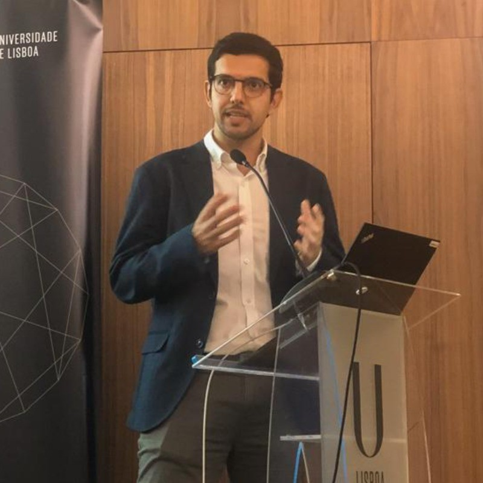

# About the instructors {.unnumbered}

## Gabriel Valença {.unnumbered}

*Assistant Professor*\
CERIS, Instituto Superior Técnico - University of Lisbon\
[Google Scholar](https://scholar.google.com/citations?user=C6ZkQvAAAAAJ&hl=en&oi=sra) \| [Linkedin](https://www.linkedin.com/in/gabriel-valen%C3%A7a-40254291/)

**Short bio**

Gabriel Valença is an Assistant Professor at Instituto Superior Técnico, University of Lisbon (Técnico ULisboa). 

He is a DTN Alumni from the 1st intake. He has completed his Ph.D. in Transportation Systems with _Summa Cum Laude_ in the Department of Civil Engineering, Architecture and Environment at Técnico ULisboa (2023). He was a Visiting Ph.D. scholar at the Technical University of Denmark for six months (2022). He has graduated in Civil Engineering at the Federal University of Rio Grande do Norte (2017), Brazil, while studying part of his degree at the University of Toronto, Canada (2013/2014). 

His work mainly focuses on the intersection between transportion engineering, urban design, and data‑driven mobility planning, with a strong emphasis on making cities more efficient, equitable, and sustainable. 

{fig-align="center" width="280"}

## Avital Angel {.unnumbered}

*Post-doctoral researcher / Soon to be Assistant professor*\
Technical University of Munich, Germany\
[Google Scholar](https://scholar.google.com/citations?user=b0gNMUoAAAAJ&hl=iw) \|  [Linkedin](https://www.linkedin.com/in/avital-angel-ab18491b4/)

**Short bio**

Dr. Avital Angel is a postdoctoral researcher at the Technical University of Munich (TUM), Chair of Urban Structure and Transport Planning, and will soon begin a position as Assistant Professor at The Hebrew University of Jerusalem. 

She is a DTN Alumni from the 2nd intake. Avital completed her PhD in Urban and Regional Planning at the Department of Architecture and Town Planning, Technion – Israel Institute of Technology. She also holds a Master’s degree in Urban and Regional Planning and a Bachelor’s degree in Landscape Architecture. Avital brings practical experience working as a former landscape architect and urban planner. 

Her research focuses mainly on linking pedestrian movement to built environment characteristics and the use of big data to analyse movement patterns in urban environments.

{fig-align="center" width="280"}
